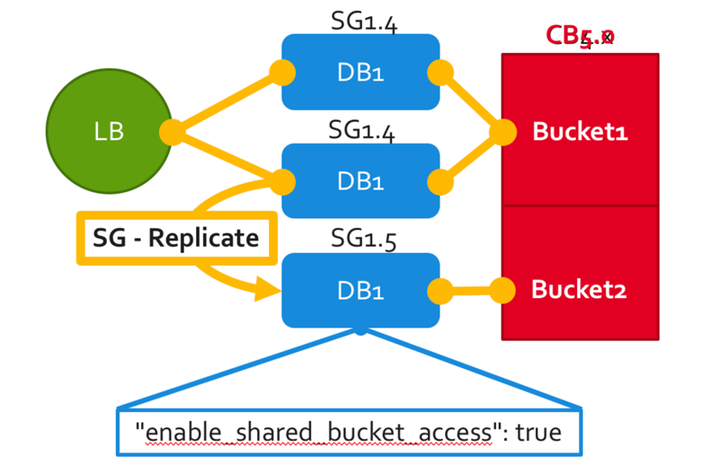

---
---



With Sync Gateway 1.5, you can seamlessly extend an existing Couchbase Server deployment to connect with remote edge devices that are occasionally disconnected or connected.

In previous releases, you either had to ensure all writes happened through Sync Gateway, or had to set up bucket shadowing to ensure that the security and replication metadata needed by mobile applications was preserved.

In this release, the metadata created by the Sync Gateway is abstracted from applications reading and writing data directly to Couchbase Server. Sync Gateway 1.5 utilizes a new feature of Couchbase Server 5.0 called XATTRs (x-attributes) to store that metadata into an external document fragment. Mobile, web and desktop applications can therefore write to the same bucket in a Couchbase cluster.

### How to enable it

This new feature was made opt-in primarily out of consideration for existing customers upgrading from Sync Gateway 1.4. It ensures that their existing configs will continue to work as-is, and supports upgrade without bringing down the entire Sync Gateway cluster. The steps below walk through how to enable this new feature.

1. [Download Couchbase Server 5.0](https://www.couchbase.com/downloads).
2. [Download Sync Gateway 1.5](https://www.couchbase.com/downloads?family=Mobile&product=Couchbase%20Sync%20Gateway&edition=Enterprise%20Edition 
).
3. Create a new bucket in the Couchbase Server Admin Console.
4. With Role Based Access Control (RBAC) newly introduced in Couchbase Server 5.0, you'll need to create a new user with authorized access to the bucket. Choose the **Security > Add User** option in the Couchbase Server Admin and select the **Bucket Full Access** and **Read Only Admin** roles.
5. Start Sync Gateway with the following configuration file.

	```json
	{
		"databases": {
			"db": {
				"bucket": "my-bucket",
				"username": "my-user",
				"password": "my-password",
				"server": "http://localhost:8091",
				"enable_shared_bucket_access": true,
				"import_docs": "continuous"
			}
		}
	}
	```
	
	There are two properties to keep in mind. The `enable_shared_bucket_access` property is used to disable the default behaviour. And the `import_docs` property to specify that this Sync Gateway node should perform import processing of incoming documents. Note that in a clustered environment, only 1 node should use the `import_docs` property.

6. On start-up, Sync Gateway will generate the mobile-specific metadata for all the pre-existing documents in the Couchbase Server bucket. From then on, documents can be inserted on the Server directly (SDKs) or through the Sync Gateway REST API. The mobile metadata is no longer kept in the document, but in a system extended attribute in Couchbase Server.

The reference to the configuration API changes can be found below.

- [$dbname.enable\_shared\_bucket\_access](config-properties/index.html#1.5/databases-foo_db-enable_shared_bucket_access) to enable convergence for a given database.
- [$dbname.import\_docs](config-properties/index.html#1.5/databases-foo_db-import_docs) to give a particular Sync Gateway node the role of importing the documents.
- [$dbname.import\_filter](config-properties/index.html#1.5/databases-foo_db-import_filter) to select which document(s) to make aware to mobile clients.

When this feature is enabled, the REST API will include the following changes.

- Sync Gateway purging ([/{db}/_purge](../../references/sync-gateway/admin-rest-api/index.html?v=1.5#/document/post__db___purge)) removes the document and its associated extended attributes.
- Sync Gateway document expiry (PUT [/{db}/{docid}](../../references/sync-gateway/admin-rest-api/index.html?v=1.5#/document/put__db___doc_)) will tombstone the active revision.

### Tombstones

When this feature is enabled, mobile tombstones are not retained indefinitely. They will be purged based on the server's metadata purge interval. To ensure tombstones are replicated to clients, you should set the server's metadata purge interval based on your expected replication frequency (see the [$dbname.enable\_shared\_bucket\_access](config-properties/index.html#1.5/databases-foo_db-enable_shared_bucket_access) reference).

### Sample App

The following tutorial demonstrates the extended attributes support introduced in Sync Gateway 1.5.

<div class="dp">
	<div class="tiles">
		<div class="column size-1of2">
			<div class="box">
				<div class="container">
					<a href="http://docs.couchbase.com/tutorials/travel-sample/">
						<p style="text-align: center;">Travel Sample Mobile</p>
					</a>
				</div>
			</div>
		</div>
	</div>
</div>
<br/>
<br/>

### Migrating from Bucket Shadowing

As of Sync Gateway 1.5, the Bucket Shadowing feature is deprecated and no longer supported. The following steps outline a recommended method for migrating from Bucket Shadowing to the latest version with interoperability between Couchbase Server SDKs and Couchbase Mobile.

1. Follow the recommendations in the [Couchbase Server documentation](https://developer.couchbase.com/documentation/server/current/install/upgrade-online.html) to upgrade all instances to 5.0.
2. Create a new bucket on Couchbase Server (**bucket 2**).
3. Install Sync Gateway 1.5 on a separate node with shared access enabled and connect it to the new bucket (**bucket 2**).
4. Setup a [push replication](running-replications/index.html) from the Sync Gateway instance used for Bucket Shadowing to the Sync Gateway 1.5 instance.
5. Once the replication has completed, test your application is performing as expected.
6. Update the load balancer to direct incoming traffic to the Sync Gateway 1.5 instance when you are ready to upgrade.
7. Delete the first bucket (**bucket 1**).

