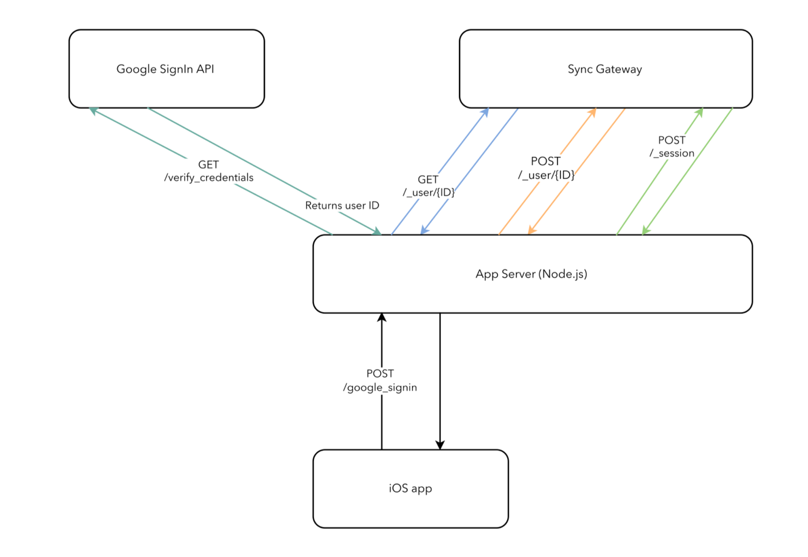
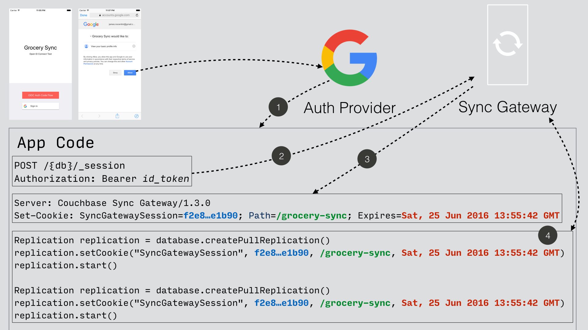

Sync Gateway supports the following authentication methods:

- [Basic Authentication](authentication.html#basic-authentication): provide a username and password to authenticate users.
- [Custom Authentication](authentication.html#custom-authentication): use an App Server to handle the authentication yourself and create user sessions on the Sync Gateway Admin REST API.
- [OpenID Connect Authentication](authentication.html#openid-connect): use OpenID Connect providers (Google+, Paypal, etc.) to authenticate users.
Static providers: Sync Gateway currently supports authentication endpoints for Facebook, Google+ and OpenID Connect providers

## User Registration

The user must be created on Sync Gateway before it can be used for authentication. Users can be created through the Sync Gateway Admin REST API or configuration file.

- **Admin REST API:** the user credentials (**username**/**password**) are passed in the request body to the [`POST /{db}/_user`](../../references/sync-gateway/admin-rest-api/index.html#/user/post__db___user_) endpoint.

	```bash
	$ curl -vX POST "http://localhost:4985/justdoit/_user/" -H "accept: application/json" -H "Content-Type: application/json" -d '{"name": "john", "password": "pass"}'
	```

	Note that the Admin REST API is **not** accessible from the clients directly.
    To allow users to sign up, it is recommended to have an app server sitting alongside Sync Gateway that performs the user validation, creates a new user on the Sync Gateway admin port and then returns the response to the application.

- **Configuration file:** user credentials are hardcoded in the configuration. This method is convenient for testing but we generally recommend to use the **Admin REST API** in a Sync Gateway deployment.

	```javascript
	{
		"databases": {
			"mydatabase": {
				"users": {
					"GUEST": {"disabled": true},
					"john": {"password": "pass"}
				}
			}
		}
	}
	```

## Basic Authentication

Once the user has been created on Sync Gateway, you can provide the same **username**/**password** to the `BasicAuthenticator` class of Couchbase Lite. Under the hood, the replicator will send the credentials in the first request to retrieve a `SyncGatewaySession` cookie and use it for all subsequent requests during the replication. This is the recommended way of using basic authentication.

Example:

- [Swift](../../couchbase-lite/swift.html#basic-authentication)
- [Java](../../couchbase-lite/java.html#basic-authentication)
- [C#](../../couchbase-lite/csharp.html#basic-authentication)
- [Objective-C](../../couchbase-lite/objc.html#basic-authentication)

## Custom Authentication

It's possible for an application server associated with a remote Couchbase Sync Gateway to provide its own custom form of authentication. Generally this will involve a particular URL that the app needs to post some form of credentials to; the App Server will verify those, then tell the Sync Gateway to create a new session for the corresponding user, and return session credentials in its response to the client app.

The following diagram shows an example architecture to support Google SignIn in a Couchbase Mobile application, the client sends an access token to the App Server where a server side validation is done with the Google API and a corresponding Sync Gateway user is then created if it's the first time the user logs in. The last request creates a session:



Given a user has already been created, the request to create a new session for that user name is the following:

```bash
$ curl -vX POST -H 'Content-Type: application/json' \
        -d '{"name": "john", "ttl": 180}' \
        http://localhost:4985/sync_gateway/_session
// Response message body
{
  "session_id": "904ac010862f37c8dd99015a33ab5a3565fd8447",
  "expires": "2015-09-23T17:27:17.555065803+01:00",
  "cookie_name": "SyncGatewaySession"
}
```

The HTTP response body contains the credentials of the session.

- **name** corresponds to the `cookie_name`
- **value** corresponds to the `session_id`
- **path** is the hostname of the Sync Gateway
- **expirationDate** corresponds to the `expires`
- **secure** Whether the cookie should only be sent using a secure protocol (e.g. HTTPS)
- **httpOnly** Whether the cookie should only be used when transmitting HTTP, or HTTPS, requests thus restricting
access from
other, non-HTTP APIs

 It is recommended to return the session details to the client application in the same form and to use the `SessionAuthenticator` class to authenticate with that session id.

Example:

- [Swift](../../couchbase-lite/swift.html#session-authentication)
- [Java](../../couchbase-lite/java.html#session-authentication)
- [C#](../../couchbase-lite/csharp.html#session-authentication)
- [Objective-C](../../couchbase-lite/objc.html#session-authentication)

## OpenID Connect

Sync Gateway supports OpenID Connect. This allows your application to use Couchbase for data synchronization and delegate the authentication to a 3rd party server (known as the Provider). There are two implementation methods available with OpenID Connect:

- [Implicit Flow](authentication.html#implicit-flow): with this method, the retrieval of the ID token takes place on the device. You can then create a user session using the POST `/{db}/_session` endpoint on the Public REST API with the ID token.
- [Authorization Code Flow](authentication.html#authorization-code-flow): this method relies on Sync Gateway to retrieve the ID token.

### Implicit Flow

[Implicit Flow](http://openid.net/specs/openid-connect-core-1_0.html#ImplicitFlowAuth) has the key feature of allowing clients to obtain their own Open ID token and use it to authenticate against Sync Gateway. The implicit flow with Sync Gateway is as follows:

1. The client obtains a **signed** Open ID token directly from an OpenID Connect provider. Note that only signed tokens are supported. To verify that the Open ID token being sent is indeed signed, you can use the [jwt.io Debugger](https://jwt.io/#debugger-io). In the algorithm dropdown, make sure to select `RS256` as the signing algorithm (other options such as `HS256` are not yet supported by Sync Gateway).
2. The client includes the Open ID token as an `Authorization: Bearer <id_token>` header on requests made against the Sync Gateway REST API.
3. Sync Gateway matches the token to a provider in its configuration file based on the issuer and audience in the token.
4. Sync Gateway validates the token, based on the provider definition.
5. Upon successful validation, Sync Gateway authenticates the user based on the subject and issuer in the token.

Since Open ID tokens are typically large, the usual approach is to use the Open ID token to obtain a Sync Gateway session id (using the [`POST /db/_session`](../../../references/sync-gateway/rest-api/index.html#!/session/post_db_session) endpoint), and then use the returned session id for subsequent authentication requests.

Here is a sample Sync Gateway config file, configured to use the Implicit Flow.

```javascript
{
  "interface":":4984",
  "log":["*"],
  "databases": {
    "default": {
      "server": "http://localhost:8091",
      "bucket": "default",
      "oidc": {
		"providers": {
  		  "google_implicit": {
      		"issuer":"https://accounts.google.com",
      		"client_id":"yourclientid-uso.apps.googleusercontent.com",
      		"register":true
  		  },
  		},
  	  }
	}
  }
}
```

#### Client Authentication

With the implicit flow, the mechanism to refresh the token and Sync Gateway session must be handled in the application code. On launch, the application should check if the token has expired. If it has then you must request a new token (Google SignIn for iOS has a method called `signInSilently` for this purpose). By doing this, the application can then use the token to create a Sync Gateway session.



1. The Google SignIn SDK prompts the user to login and if successful it returns an ID token to the application.
2. The ID token is used to create a Sync Gateway session by sending a POST `/{db}/_session` request.
3. Sync Gateway returns a cookie session in the response header.
4. The Sync Gateway cookie session is used on the replicator object.

Sync Gateway sessions also have an expiration date. The replication `lastError` property will return a **401 Unauthorized** when it's the case and then the application must retrieve create a new Sync Gateway session and set the new cookie on the replicator.

You can configure your application for Google SignIn by following [this guide](https://developers.google.com/identity/).

### Authorization Code Flow

Whilst Sync Gateway supports [Authorization Code Flow](), there is considerable work involved to implement the **Authorization Code Flow** on the client side. Couchbase Lite 1.x has an API to hide this complexity called `OpenIDConnectAuthenticator` but since it is not available in the 2.0 API we recommend to use the **Implicit Flow**.